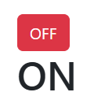

# Module 4 - Ma première application

  
## 2 façon d'écrire "export default"
Peut s'écrire de 2 façon  
écomomise une ligne

```tsx
import './App.css'

function App() {
  return (
    <h1>hello World !</h1>
  )
}
export default App
```

## ou bien

```tsx
import './App.css'

export default function App() {
  return (
    <h1>hello World !</h1>
  )
}
```

## les balises fragments
```tsx
export default function App() {
  return (
    <> {/*balise framgments */}
     <h1>Hello</h1>
    <h2>Brad PITT !</h2>
    </>
  )
}
```

# Mise en place de ma première application
:one: Mise en place d’un formlaire  
:two: L’action : (le bouton) gestion du "submit"  
:three: Mise en place de useState  

## :one: Mise en place du formulaire
```tsx
return (
    <> 
    <form method="post" onSubmit={affiche}>
      <input name="prenom" />
      <input name="nom" />
      <button type="submit">Valider</button>
    </form>
    </>
  )
```
Ajouter des valeurs par défaults aux champs input  

```tsx
return (
    <> 
    <form method="post" onSubmit={affiche}>
      <input name="prenom" defaultValue="Brad" />
      <input name="nom" defaultValue="PITT" />
      <button type="submit">Valider</button>
    </form>
    </>
  )
```
## :two: L’action : (le bouton) gestion du "submit"


<code> e.preventDefault();</code> empeche/bloque l'envoie du formulaire ou le Reload de la page  
```tsx
export default function App() {
  function affiche(e) {
    e.preventDefault();
    console.log(e.target.prenom.value + " " + e.target.nom.value);
  };
  return (
    <>
      <form method="post" onSubmit={affiche}>
        <input name="prenom" defaultValue="Brad" />
        <input name="nom" defaultValue="PITT" />
        <button type="submit">Valider</button>
      </form>
    </>
  );
}
```
  
Encore mieux avec les fonctions fléchées : **arrow function**
  
```tsx
export default function App() {
  const affiche = (e) => {
    e.preventDefault();
    console.log(e.target.prenom.value + " " + e.target.nom.value);
  };
  return (
    <>
      <form method="post" onSubmit={affiche}>
        <input name="prenom" defaultValue="Brad" />
        <input name="nom" defaultValue="PITT" />
        <button type="submit">Valider</button>
      </form>
    </>
  );
}
```
## :three: Mise en place de useState  

```tsx
import "./App.css";
import {useState} from 'react'; // 1: importer

export default function App() {
  const [message,setMessage] = useState('') // 2: declarer
  const affiche = (e)=> {
    e.preventDefault();
    const prenom = e.target.prenom.value;
    const nom = e.target.nom.value;
    setMessage('Hello '+prenom + " " + nom);
  };
  return (
    <>
      <form method="post" onSubmit={affiche}>
        <input name="prenom" defaultValue="Brad" />
        <input name="nom" defaultValue="PITT" />
        <button type="submit">Valider</button>
      </form>
       <h1>{message}</h1> {/* 3: utiliser */}
    </>
  );
}
```

## Mise en place des littéraux de gabarit :heart_eyes:  

### :rocket: Avec la cerise sur le gateau : **${}**
```tsx
import "./App.css";
import {useState} from 'react';// 1: importer
export default function App() {
  const [message,setMessage] = useState('') // 2: declarer
  const affiche = (e)=> {
    e.preventDefault();
    const prenom = e.target.prenom.value;
    const nom = e.target.nom.value;
    setMessage(`Hello ${prenom} ${nom}`); // la cerise ;)
  };
  return (
    <>
      <form method="post" onSubmit={affiche}>
        <input name="prenom" defaultValue="Brad" />
        <input name="nom" defaultValue="PITT" />
        <button type="submit">Valider</button>
      </form>
      <h1>{message}</h1> {/* 3: utiliser */}
    </>
  );
}
```

## Ajouter Bootstrap et ses classes
```tsx
import "./App.css";
import {useState} from 'react';// 1: importer
export default function App() {
  const [message,setMessage] = useState('') // 2: declarer
  const affiche = (e)=> {
    e.preventDefault();
    const prenom = e.target.prenom.value;
    const nom = e.target.nom.value;
    e.target.prenom.value='';
    e.target.nom.value='';
    setMessage(`Hello ${prenom} ${nom}`); // la cerise ;)
  };
  return (
    <div className="container">
      <div className="col-4">
        <h1> Démo</h1>
      <form method="post" onSubmit={affiche}>
        <input name="prenom" 
        className="form-control" 
        placeholder="Prénom"/>
        <input name="nom" 
        className="form-control my-3"
        placeholder="Nom" />
        <button type="submit" className="btn btn-primary">
          Valider</button>
      </form>
      <h1>{message}</h1> {/* 3: utiliser */}
      </div>
      </div>
  );
}
```

# Modifier le CSS avec les template de gabarits ${}
Remplacer la concaténation par **${}**  
 
  
<br>

```jsx
import { useState } from 'react'

export default function App() {
  const [etat,setEtat]= useState(true)

  const changer =()=>{
    setEtat(!etat)
  }
  return (
    <div className="container">
      {/* className="btn btn-success" OU className="btn btn-danger" */}
      <button 
        className={`btn btn-${etat? 'danger': 'success'}`} 
        onClick={changer}>{etat ? 'OFF' : 'ON'}</button>

      <h1>{etat ? 'ON' : 'off'}</h1>
    </div>
  )
}
```

