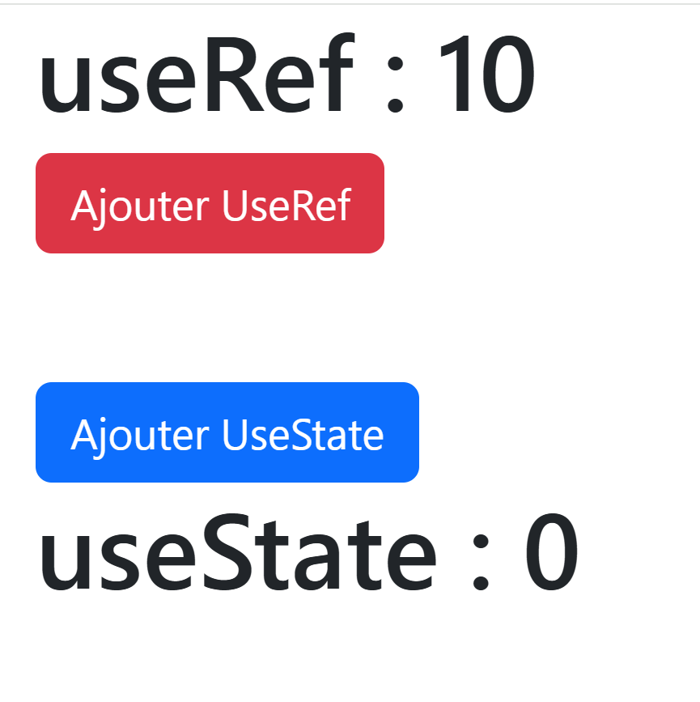

# useRef ?
Prise en main de <code>useRef</code> 
## Comment utiliser useRef ?
Mise en place de <code>useRef</code>   
:one: Importer  
:two: Déclarer  & définir une valeur par défault avec <code>useRef()</code>  
:three: afficher _On note que la valeur est stocker dans l'attribut_ <code>.current</code>  
  
```jsx
import { useRef } from 'react';
export default function App() {
  const nombre = useRef(12);
  return (
    <h1>{nombre.current}</h1>
  )
}
```
## Cela ne marche pas ?
Lorsque je clique la valeur dans la vue HTML **ne** change **pas** !    
**Pourquoi ?**  
La modification d'un useRef **ne** déclenche **pas** un **"Redering"** de la vue HTML   

```jsx
import { useRef } from 'react';
export default function App() {
  const nombre = useRef(12);
  const changer = () => {
    nombre.current = 24;
  }
  return (
    <>
    <h1>{nombre.current}</h1>
    <button onClick={changer}></button>
    </>
  )
}
```

# useRef VERSUS UseState
Afin de bien comprendre la différence entre <code>useState</code> et <code>useRef</code>    
Voici un exmple avec 2 compteurs    
Nous pouvons constater que la modification de <code>useRef</code> **ne** déclencle **pas** un **"Rendering"** de la vue HTML.



```jsx
import { useRef, useState } from "react";

export default function App() {
  const compteurRef = useRef<number>(10); // compteur.current =0
  const [compteurState, setCompteurState] = useState<number>(0);
  const ajouterRef = () => {
    compteurRef.current = compteurRef.current + 1;
    console.log(compteurRef.current);
  };
  const ajouterState = () => {
    setCompteurState(compteurState + 1);
  };
  // la partie jsx ou tsx
  return (
    <div className="container">
      <h1> useRef : {compteurRef.current} </h1>
      <button onClick={ajouterRef} className="btn btn-danger">
        Ajouter UseRef
      </button>

      <br />
      <br />
      <br />
      <button onClick={ajouterState} className="btn btn-primary">
        Ajouter UseState
      </button>
      <h1> useState : {compteurState} </h1>
    </div>
  );
}

```

# Le 2 ways binding 


```jsx
import { useRef, useState } from "react"

export default function App(){
  const [fullName,setFullname]= useState<string>('');
  const prenom = useRef<HTMLInputElement>(null);
  const nom = useRef<HTMLInputElement>(null);
  const afficher =()=>{
    console.log(prenom.current?.value)
    console.log(nom.current?.value)
    setFullname(`${prenom.current?.value } ${nom.current?.value }`)

  }
  return(
    <>
    <input ref={prenom} onChange={afficher} />
    <input ref={nom}   onChange={afficher}/>
    <h1>{fullName}</h1>

    </>)
}
```