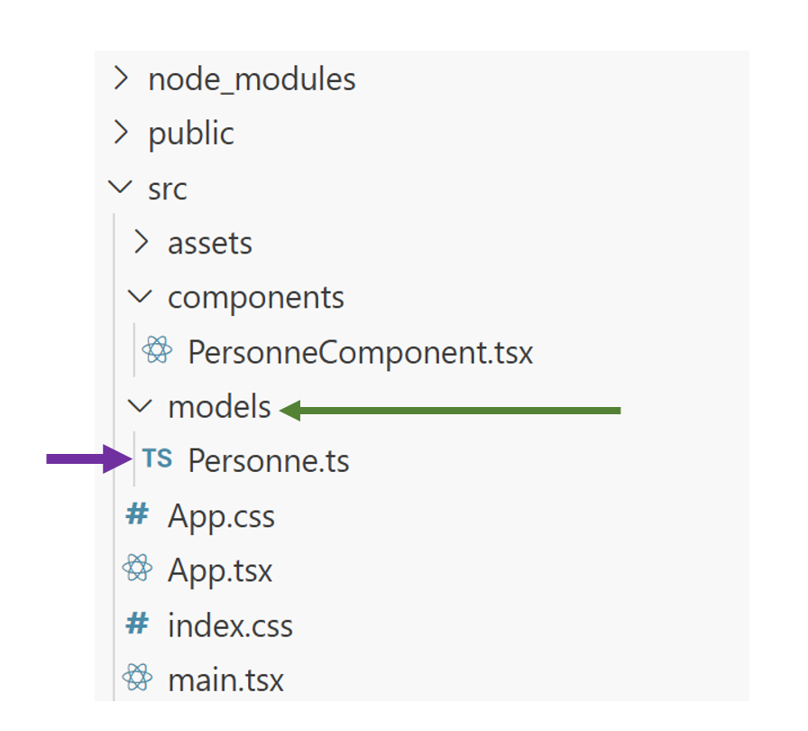
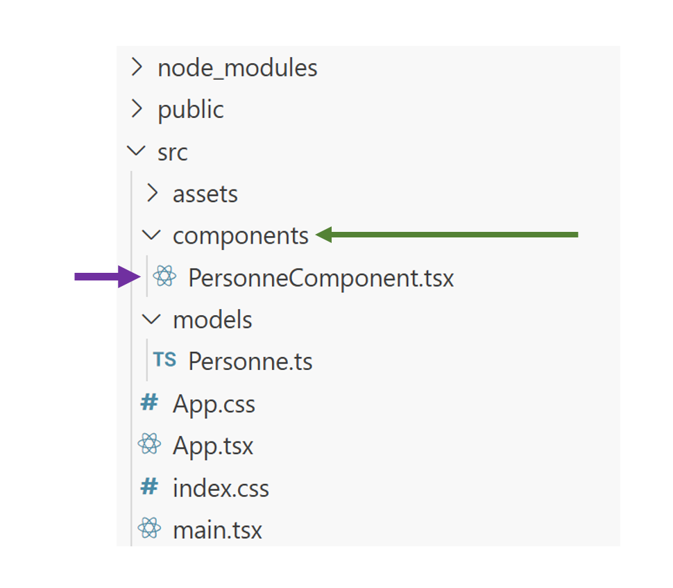

# Création d'un composant 

## Partie javaScript

### Création du composant PersonneComponent.jsx
Création du repertoir <code>components</code>
Création du fichier <code>PersonneComponent.jsx</code>

```
|-- src
    |-- components
          |-- Personne.jsx
```
### PersonneComponent.jsx
```jsx
export default function PersonneComponent({personne,indice,qui}) {

  return (
    <>
      <h1>{indice} {personne.prenom} {personne.nom}</h1>
      <button onClick={()=>qui(indice)}>qui ?</button>
    </>
  )
}
```

### App.jsx
```jsx
import './App.css'
import PersonneComponent from './components/PersonneComponent';
export default function App() {
const [personnes, setPersonnes] = useState([
  {prenom:'Brad',nom:'PITT'},
  {prenom:'Angelina',nom:'JOLIE'},
]);
  const qui = (indice) => {
    console.log("qui",indice);
    console.log(personnes[indice]);
  }
  return (
    <>
    {
      personnes.map((personne,indice) => 
      <PersonneComponent 
      key={indice} 
      personne={personne} 
      indice={indice}
      qui={qui}
      />)
    }
    </>
  )
}

```

## Partie en type script
Création du repertoir <code>models</code>
Création du fichier <code>Personne.ts</code>
  
Création du repertoir <code>components</code>
Création du fichier <code>PersonneComponent.tsx</code>


### Personne.ts
  

  

```
|-- src
        |-- models
            |-- Personne.ts
```
```ts
export class Personne{
   public prenom?:string;
   public nom?:string;

   // 3 signature decontructeur
    constructor (  prenom:string,  nom:string){
        this.prenom = prenom;
        this.nom = nom;
    }
}
```

### PersonneComponent.tsx
  

  
```
|-- src
        |-- components
            |-- PersonneComponent.tsx
```

```tsx
import  { Personne } from "./models/Personne";

interface IpropsPersonne{
    p:Personne;
    indice:number;
    qui:(indice:number)=> void;
}


export default function PersonneComponent(props:IpropsPersonne){
    return (
        <>
        <h1>Je suis {props.p.prenom} {props.p.nom}</h1>
        <button onClick={()=> props.qui(props.indice)}>Qui ?</button>
        </>
    );
}
```
### App.tsx
```tsx

import PersonneComponent from "./components/PersonneComponent";
import  { Personne } from "./models/Personne";


export default function App() {
  const personnes:Personne[]=[
    {prenom:'Brad',nom:'PITT'},
    {prenom:'Tom',nom:'CRUISE'},
    {prenom:'Nicolas',nom:'CAGE'}
  ]
  const qui =(indice:number):void=>{
    console.log(indice);
    console.log(personnes[indice])
  }
  return (
    <>
    <div className="container">
      
      {
        personnes.map((personne,indice)=>
        <PersonneComponent 
        personne={personne} 
        
        indice={indice}
        qui={qui}
        key={indice} // personne.id
        />)
      }

      </div>
    </>
  );
}

```