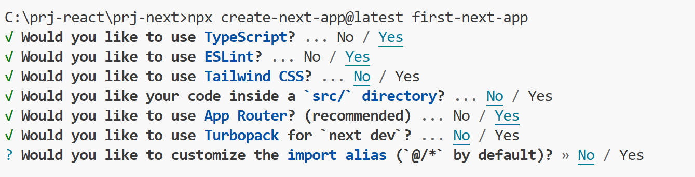

# module 14 Next.js

Next.js est un framework basé sur React qui permet de créer des applications web modernes, performantes et SEO-friendly, en combinant :

- Rendu côté serveur (SSR)  
- Génération statique de pages (SSG)
- Routage automatique
- API intégrée
- Support de TypeScript, Tailwind, etc


Le site :
[nextjs.org](https://nextjs.org/)

```
npx create-next-app@latest first-next-app
```




```
npm run dev
```

page.tsx
regular component


## Création d'une page
```
app  
└─── about
│    └─── page.tsx

```

```tsx
import styles from "./page.module.css";

export default function Home() {

  return (
    <div >
      <a href="about/">About</a>
       <br /><br />
      <Link href="about/">About 2</Link>
    </div>
  );
}
```


```tsx
export default function AboutPage() {

  return (<main><h1>About Us</h1></main>);
}
```

layout.tsx Englobe page.tsx


```tsx
import type { Metadata } from "next";
import "./globals.css";

export const metadata: Metadata = {
  title: "New",
  description: "Generated by create next app",
};

export default function RootLayout({
  children,
}: Readonly<{
  children: React.ReactNode;
}>) {
  return (
    <html lang="en">
      <body>
        {children}
      </body>
    </html>
  );
}

```
## importer des components

header.tsx
```tsx
import logo from '@assets/logo.png'
export default function Header() {

  return (<header>header
  
  </header>);
}
```
mettre les components en dehors de app

```tsx
import styles from "./page.module.css";

export default function Home() {

  return (
    <div >
      <a href="about/">About</a>
    </div>
  );
}
```

## les routes avec parametres
```
app  
└─── blog
│    └─── page.tsx
│    └─── [slug]
│           └─── page.tsx
```

blog/page.tsx 
```tsx
import Link from "next/link";

export default function BlogPage() {

  return (<main>
  <h1>Blog</h1>
    <br /><br />
      <Link href="blog/post-1">post 1</Link>
       <br /><br />
      <Link href="blog/post-1">About 2</Link>
  </main>);
}
```

blog/[slug]/page.tsx 
```tsx
import Link from "next/link";

export default function BlogPostPage({params}: {params: {slug: string}}) {

  return (<main>
  <h1>Blog Post Page</h1>
    <br /><br />
      {params.slug}
  </main>);
}


```
excercice ajouter le header 
