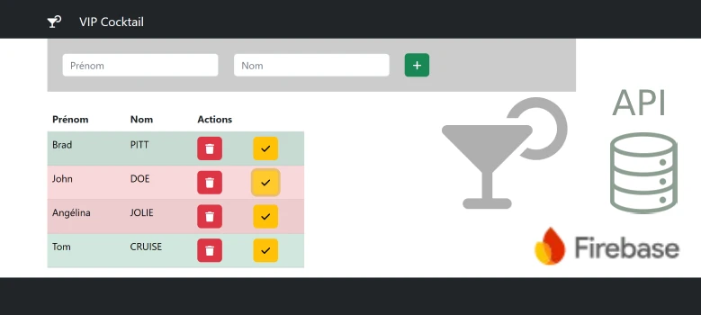

# TP 08 - Cocktail VIP avec Firebase
 

## Objectifs
 

- Ajouter une personne dans Real Time data base.  
- Afficher la liste de personnnes au démarrage.  
- Enlever la personne de la liste. 
- Modifier l'état de la personne.  

## Problème on récupère les personnes comme ceci
```js
let data= {
    "-OB5oS7whXKqTlbBCZFx" :{nom: "PITT", "prenom": "Brad"},
    "-OB5oSII9wHESMfLsEKC" :{nom: "CAGE", "prenom": "Nicolas"},
    "-OB5oSPEiZ3ut529fo0a" :{nom: "JOLIE", "prenom": "Angelina"}
}
```

## C'est à dire comme cela
```js
let data= {
    "id1" :{nom: "PITT", "prenom": "Brad"},
    "id2" :{nom: "CAGE", "prenom": "Nicolas"},
    "id3" :{nom: "JOLIE", "prenom": "Angelina"}
}
```

## Et on souhaiterais avoir cela
```js
let personnes = [
    {nom: "PITT", "prenom": "Brad", id:"id1"},
    {nom: "CAGE", "prenom": "Nicolas", id:"id2"},
    {nom: "JOLIE", "prenom": "Angelina", id:"id3"}
]
```

## penser à for + in
```js
for (let attribut in data){
    console.log(attribut);
    console.log(data[attribut]);
    
}
```

## Ou bien Object.keys
```js
 Object.keys(data).map( attribut => {
    console.log(attribut);
    console.log(data[attribut]);
   }
```

# Demo firebase
```js
import axios from 'axios'

export default function App() {
  const url = 'https://alpha-javascript-default-rtdb.europe-west1.firebasedatabase.app/'
  const noeud = 'films'
  const ecrire = async() => {
    const url2 =`${url}${noeud}.json`
    const film ={ titre:'THE MATRIX', annee:'1999'}
    const response = await axios.post(url2,film);
    console.log(response.data)
    const id = response.data.name
  }
  const lecture = async() => {
    const url2 =`${url}${noeud}.json`
    const response = await axios.get(url2);
    console.log(response.data)
  }
  const effacer = async() => {
    const id = '-ODFsVtJZAhHWyZwTJef'
    const url2 =`${url}${noeud}/${id}.json`
    //https://alpha-javascript-default-rtdb.europe-west1.firebasedatabase.app/films/-ODFsVtJZAhHWyZwTJef.json
    const response = await axios.delete(url2);
    console.log(response.data)
  }
  const modifier = async() => {
    const id = '-ODFs8rx-Sr5roPN0tSv'
    const url2 =`${url}${noeud}/${id}.json`
    const f ={  annee:'2023'}
    const response = await axios.patch(url2,f);
    console.log(response.data)
  }
const test= ()=>{
  const p = { nom:'Pitt', prenom:'Brad'}
  // parcourir un objet
  for (const attribut in p) {
    console.log(attribut); // prenom ... nom
    console.log(p[attribut]); // Brad ... Pitt 
  }
  
} 


  return (
    <>
    <button onClick={ecrire}>ecrire</button>
    <button onClick={lecture}>lecture</button>
    <button onClick={effacer}>effacer</button>
    <button onClick={modifier}>modifier</button>
    <button onClick={test}>test</button>
    </>
  )
}
```