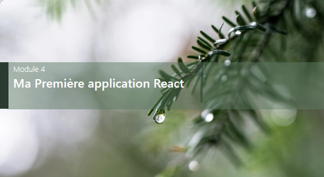

# Plan de la formation

## les TP ou Ateliers
<a href="https://sevenvalley.fr/tp-react/">
 
les tp ou ateliers
 
  
</a>
  

## 01 - Présentation
  

- Javascript ou Vanilla Javascript  
- Les Framework JavaScript  
- Historique  
- Caractéristiques du langage  
- Une Single Page Application ?  
- Présentation du serveur NodeJS  
- Le principe de composant avec React  

## 02 - Le JavaScript Next Génération
  

- Définition de variables : let , const et var  
- Les fonctions fléchées  
- Utilisation de Export import  
- L’opérateur Spread … et Rest  

## 03 - Installation et création du premier projet
  

- Installation de NodeJS  
- Mise à jour de NPM Node Package Manager  
- Installation du CLI Command Line Interface  
- Définir un répertoire pour nos projets React  
- Création du premier projet  
- Ajouter Bootstrap au projet  
- Ajouter Font Awesome au projet  
- Lancer le projet  
- Architecture du projet 

## 04 - Ma première application
  

- Prise en main de useState  
- Les formulaires  
- Le JSX  

## 5 - Le 2 ways binding : input
  

- Ecouter le champ input en temps réel
- useRef VERSUS useState

## 6 Création d’un composant
  

- Envoyer des données à un composants  
- Les props  
- Props et fonctions  
- Communiquer avec le composant mère  

## 7 Interroger une API
  

- Mise en place de useEffect  
- Utilisation de axios ou fetch  
- Comprendre la méthode GET http  
- Persistence avec localStorage et SessionStorage  

## 8 Communiquer avec une API : RealTime database Firebase
 

- Application Full Stack  
- Mise en place d’un backend en 5 minutes  
- Comprendre le backend / no Backend de Firebase  
- Ajouter avec la méthode POST  
- Modifier avec la méthode PUT et PATCH  
- Supprimer avec la méthode DELETE  
- Comprendre l’intérêt de POSTMAN  

## 9 Le routing
 

- Création des nouveaux fichiers pour les pages    
- Création de la barre de navigation   
- Création du Router    
- Création d’une page produit avec un ID    
- Les Différentes façons de naviguer   

## 10 React Hook Form
 

 - Mise en place simple  
 - comparaison avec un formulaire  
 - le watch / 2 ways binding  
 - gestion des Erreures  
 - typage  

